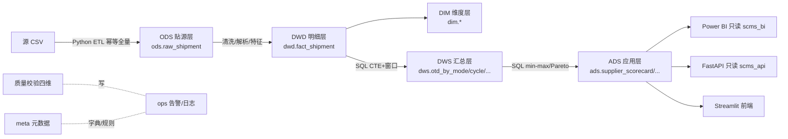

# SCMS Delivery — 交付供应链绩效分析（数仓工程版）

对 SCMS（PEPFAR 下）向非洲及受援国配送 HIV 抗病毒药 / 检测试剂的历史交付数据（10,324 行，2006–2015，43 国 73 供应商），做 **MySQL 五层数仓 + 数据质量 + SQL 分析 + BI + API 服务** 的全链路工程化分析。

## 架构



- **五层数仓**：ODS → DWD → DIM → DWS → ADS，另加 `meta`（元数据）/`ops`（运行告警）两个治理 schema，共 7 schema。
- **最小权限账号**：`scms_etl`（管道，DML）、`scms_bi`（BI 只读）、`scms_api`（API 只读）；DDL 仅 root。
- **口径一致**：SQL 物化与 pandas 研究层用 `reconcile.py` 对账（20 项全 PASS，见 `output/对账报告.md`）。

## 目录

```
dw/        # 数仓：ddl(schema/grants/init/导出字典)、etl、quality、analytics(SQL+对账)
api/       # FastAPI 服务 + pytest + Streamlit 前端
bi/        # Power BI 接入指南 + 度量口径对照表
deploy/    # 一键编排 run_pipeline.py + 定时任务 + .env.example
scripts/   # 研究分析层（统计检验/回归/绘图，pandas 黄金口径来源）
docs/      # 口径文档 v2.0 / 数据仓库设计 / 数据字典 / 清洗决策表
output/    # 巡检报告 / 对账报告 / 清洗数据 / 图表
config/    # .env（数据库凭据，不入库）
```

## 快速启动

### 1. 初始化数据库（建 7 schema + 账号 + 元数据）

```bash
uv sync                                   # 安装依赖（uv.lock 锁版本）
uv run python dw/ddl/init_db.py <root密码>  # 重建 schema、生成专用账号密码写入 config/.env
```

### 2. 跑数据管道（ETL → SQL 物化 → 质量 → 对账）

```bash
uv run python deploy/run_pipeline.py
```

等价分步：`dw/etl/ingest.py` → `dw/analytics/refresh_ads.py` → `dw/quality/run.py` → `dw/analytics/reconcile.py`

### 3. 启动查询服务

```bash
uv run uvicorn api.main:app --host 127.0.0.1 --port 8000   # FastAPI
uv run streamlit run api/dashboard.py                       # 前端（另开终端）
uv run pytest -q                                            # 接口测试
```

### 4. 定时任务（可选）

```powershell
.\deploy\register_task.ps1   # 注册 Windows 任务计划，每日自动跑管道
```

## 关键结论

- 准时交付率 **OTD 88.51%**，迟到中位 12 天、P99 164 天（长尾严重）。
- 采购周期瓶颈在「下单 → 计划」段（中位 92 天，占全程约 60%）；Ocean/卡车与中部非洲延迟最重。
- 运费回归 R²≈0.68：重量规模效应显著（log_weight 系数 -0.45）、空运单位运费约为海运 6 倍。
- 供应商高度集中（`SCMS from RDC` 占金额 66.7%），Aurobindo 为「大体量 + 低准时」首要整改对象。

> 详见 `report/`（综合报告 / Top5 Insights / 透视表）。

## 故障排查

| 现象 | 处理 |
|---|---|
| `init_db` 连不上 MySQL | 检查服务 `MySQL80` 是否 Running；确认 root 密码 |
| 管道某阶段失败 | 看 `ops.run_log` 表，或直接跑该阶段脚本看报错 |
| 对账失败 | 先跑 `scripts/01_prepare.py` 重新生成研究层基准，再重跑 `reconcile.py` |
| API 读不到 dws | `scms_api` 仅授权 `ads`/`dim`，dws 结果请走 `ads.v_*` 视图 |
| Power BI 连不上 | 确认用 `scms_bi` 账号；MySQL 需装 Connector/ODBC（见 `bi/README.md`） |
| 中文乱码（控制台） | 数据/文件均为 UTF-8，控制台 GBK 显示乱码不影响产物 |

## 说明

本仓库仅用于数据分析与工程实践练习；结论为基于历史数据的描述性/关联性分析，不构成对 SCMS 或任何组织的业务评价。
